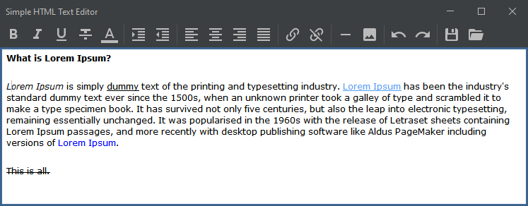
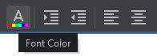

# jHTMLEditor

Simple HTML Editor in Swing. Open Source Java project under Apache License v2.0

### Current PoC version is [1.0.0](https://github.com/ggrandes/jhtmleditor/releases)

---

## Requirements, Installation and Running

* Java Runtime (11 o newer): https://jdk.java.net/java-se-ri/17
* This software run in [Portable Mode](https://en.wikipedia.org/wiki/Portable_application), you only need to copy jar file in a folder to install.
* Run with `java -jar jhtmleditor-x.x.x.jar`

---

## Screenshots

###### Main Window 

###### Most of the controls have "hints" 

---

## Credits

Notable contributions:

* [@DevCharly](https://github.com/DevCharly) for [FlatLaf](https://github.com/JFormDesigner/FlatLaf).
* [@aalmiray](https://github.com/aalmiray) for [Ikonli](https://github.com/kordamp/ikonli).
* ... many others - thank you for contributing to FLOSS.

---
Inspired in [Howard Kistler's Ekit](http://www.hexidec.com/ekit.php) and [Charles Bell's HTMLDocumentEditor](https://gist.github.com/ggrandes/4079765ac52942cf6b93014dd3278bdd), this code is Java-minimalistic version.
